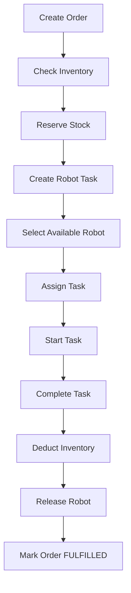
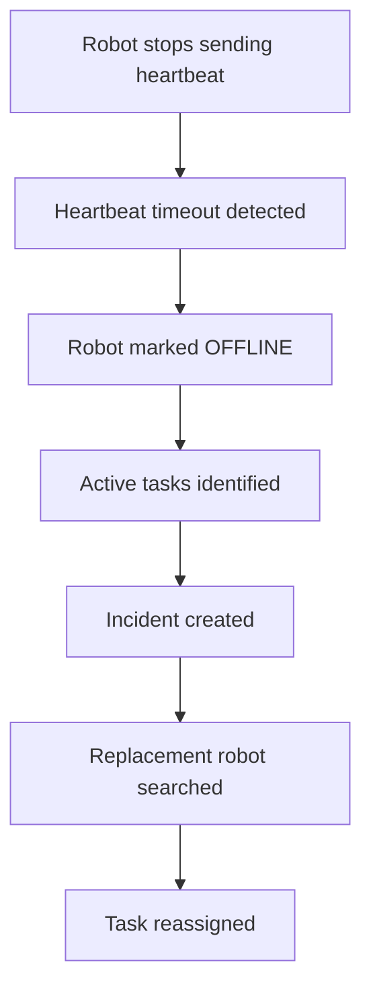
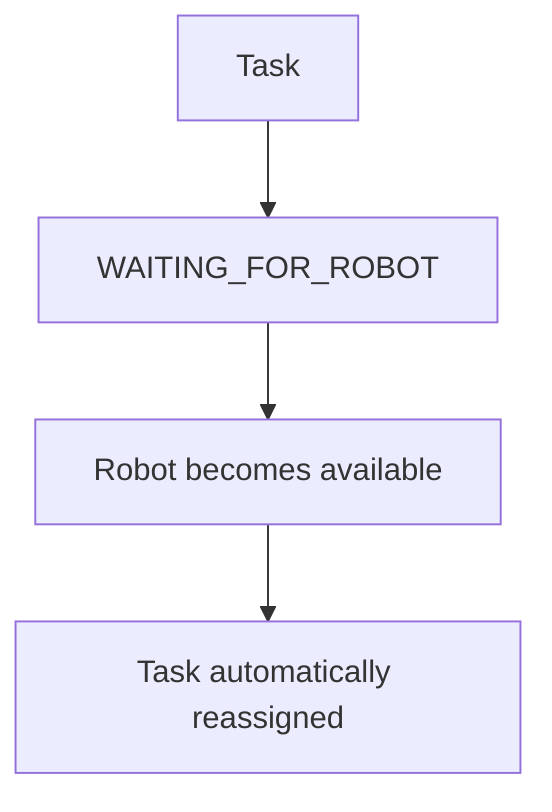

# Warehouse Fulfillment & Robot Orchestration System

A backend microservices system for warehouse order fulfillment, inventory management,
robot task assignment, heartbeat monitoring, failure detection, and automatic task recovery.

## Architecture

```text
                         ┌─────────────────┐
                         │   API Gateway   │
                         │     :8084       │
                         └────────┬────────┘
                                  │
              ┌───────────────────┼───────────────────┐
              │                   │                   │
              ▼                   ▼                   ▼
       ┌─────────────┐     ┌─────────────┐     ┌─────────────┐
       │    Order    │     │  Inventory  │     │    Robot    │
       │   Service   │     │   Service   │     │   Service   │
       │    :8080    │     │    :8081    │     │    :8082    │
       └──────┬──────┘     └─────────────┘     └──────┬──────┘
              │                                        │
              │                                        │
              └────────────────┐       ┌───────────────┘
                               ▼       ▼
                         ┌──────────────────┐
                         │   Orchestrator   │
                         │      :8083       │
                         └──────────────────┘

                         ┌──────────────────┐
                         │      Eureka      │
                         │      :8761       │
                         └──────────────────┘

                         ┌──────────────────┐
                         │   PostgreSQL     │
                         └──────────────────┘
```
# Services

| Service              | Port | Responsibility                                  |
| -------------------- | ---: | ----------------------------------------------- |
| Eureka Server        | 8761 | Service discovery                               |
| Order Service        | 8080 | Order creation and status management            |
| Inventory Service    | 8081 | Stock checking, reservation and completion      |
| Robot Service        | 8082 | Robot management, tasks, heartbeat and recovery |
| Orchestrator Service | 8083 | Fulfillment workflow coordination               |
| API Gateway          | 8084 | Single entry point and request routing          |

# Technology Stack
- Java 25
- Spring Boot
- Spring Cloud
- Spring Cloud Eureka
- Spring Cloud OpenFeign
- Spring Cloud Gateway
- PostgreSQL
- Maven
- REST APIs
- Docker / Docker Compose

# Core workflow



# Robot Selection
A robot is eligible when:
- Status is AVAILABLE
- Battery level is at least 30%

Among eligible robots, the robot with the highest battery level is selected.

# Robot Failure Recovery
The Robot Service monitors robot heartbeats.
## Robot Failure & Task Reassignment



If no replacement robot is available:
## Task Reassignment Workflow



# Incident Management
Robot failures create incidents containing:
- Robot
- Task
- Incident type
- Status
- Description
- Creation time
- Resolution time
 
Open incidents are prevented from being duplicated for the same task.

# Service communication
Services communicate using REST APIs and Spring Cloud OpenFeign.

Eureka provides service discovery so services can communicate using logical service names rather than hardcoded host addresses.

# Configuration
Database credentials are supplied through environment variables.

# Setup & Installation

## Prerequisites

Make sure the following are installed:

* Java 25
* Maven
* PostgreSQL
* Git
* Docker & Docker Compose
* Postman (recommended for API testing)

Verify the installations:

```bash
java -version
mvn -version
docker --version
docker compose version
```

## Clone the Repository

```bash
git clone <your-repository-url>
cd "Warehouse project"
```

## Database Setup

The project uses PostgreSQL for persistent data storage.

Create the required databases:

```sql
CREATE DATABASE warehouse_orders;
CREATE DATABASE warehouse_inventory;
CREATE DATABASE warehouse_robot;
```

Configure the database connection for each service using environment variables.

Example:

```text
DB_HOST=localhost
DB_PORT=5432
DB_USERNAME=postgres
DB_PASSWORD=your_password
```

The services use Spring Data JPA and Hibernate for database access and schema management.

> Make sure PostgreSQL is running before starting the services.

# Running the Application

The system contains six Spring Boot applications.

Start them in the following order:

### 1. Eureka Server

```bash
cd eureka-server
./mvnw spring-boot:run
```

Windows:

```powershell
.\mvnw.cmd spring-boot:run
```

Eureka Dashboard:

```text
http://localhost:8761
```

### 2. Order Service

```powershell
cd order-service
.\mvnw.cmd spring-boot:run
```

Runs on:

```text
http://localhost:8080
```

### 3. Inventory Service

```powershell
cd inventory-service
.\mvnw.cmd spring-boot:run
```

Runs on:

```text
http://localhost:8081
```

### 4. Robot Service

```powershell
cd robot-service
.\mvnw.cmd spring-boot:run
```

Runs on:

```text
http://localhost:8082
```

### 5. Orchestrator Service

```powershell
cd orchestrator-service
.\mvnw.cmd spring-boot:run
```

Runs on:

```text
http://localhost:8083
```

### 6. API Gateway

```powershell
cd api-gateway
.\mvnw.cmd spring-boot:run
```

Runs on:

```text
http://localhost:8084
```

Once all services are running, they should appear as registered instances in the Eureka Dashboard.

# API Usage

The API Gateway acts as the main entry point for clients.

Instead of directly calling individual services, clients can communicate through:

```text
http://localhost:8084
```

## Create Fulfillment Request

### Endpoint

```http
POST /api/fulfillment
```

Example:

```http
POST http://localhost:8084/api/fulfillment
```

Request body:

```json
{
  "orderNumber": "ORD-2001",
  "productCode": "PROD-101",
  "quantity": 5
}
```

The Orchestrator coordinates the complete fulfillment process.

### Fulfillment Flow

```text
Client
  |
  v
API Gateway
  |
  v
Orchestrator
  |
  +----> Order Service
  |
  +----> Inventory Service
  |
  +----> Robot Service
  |
  v
Fulfillment Completed
```

# Example Fulfillment Scenario

Assume the warehouse contains:

```text
Order:
ORD-2001

Product:
PROD-101

Quantity:
5
```

The fulfillment request triggers the following operations:

1. Validate the order.
2. Check product availability.
3. Reserve the required inventory.
4. Create a robot task.
5. Find an eligible robot.
6. Assign the task to the robot.
7. Start the task.
8. Complete the task.
9. Deduct the fulfilled quantity from inventory.
10. Release the robot.
11. Mark the order as `FULFILLED`.

If a step fails, the system handles the failure according to the corresponding recovery logic.

# Robot Management

The Robot Service maintains information about warehouse robots.

Example robot data:

```json
{
  "robotCode": "BOT-001",
  "status": "AVAILABLE",
  "batteryLevel": 85,
  "location": "ZONE-A"
}
```

Robot states can include:

```text
AVAILABLE
BUSY
OFFLINE
```

A robot must satisfy the eligibility conditions before receiving a task.

Current eligibility rules:

* Robot status must be `AVAILABLE`
* Battery level must be at least `30%`

Among eligible robots, the robot with the highest battery level is selected.

# Heartbeat Monitoring

Robots periodically send heartbeat information to the Robot Service.

The heartbeat allows the system to determine whether a robot is still active.

```text
Robot
  |
  | Heartbeat
  v
Robot Service
  |
  v
Update lastHeartbeat
```

If the heartbeat is not received within the configured timeout period:

```text
Heartbeat Timeout
       |
       v
Robot marked OFFLINE
       |
       v
Active task identified
       |
       v
Incident created
       |
       v
Replacement robot searched
       |
       +------ Available ------> Task reassigned
       |
       +------ None -----------> Task waits
```

# Failure Recovery

The system is designed to recover from robot failures without manually recreating the task.

## Scenario 1: Robot Failure With Replacement Available

```text
Robot A
   |
   | Assigned Task
   v
Task IN_PROGRESS
   |
   | Heartbeat timeout
   v
Robot A -> OFFLINE
   |
   v
Incident Created
   |
   v
Available Robot B Found
   |
   v
Task Reassigned
   |
   v
Robot B Executes Task
```

## Scenario 2: No Replacement Robot Available

If no eligible robot is available, the task is moved into a waiting state.

```text
Robot Failure
      |
      v
Task WAITING_FOR_ROBOT
      |
      v
No Robot Available
      |
      | later
      v
Robot Becomes AVAILABLE
      |
      v
Task Automatically Reassigned
```

This prevents the fulfillment workflow from permanently losing a task because of a temporary robot outage.

# Incident Management

Robot failures generate incidents that can be used to track and resolve operational problems.

An incident contains information such as:

```text
Robot
Task
Incident Type
Status
Description
Created At
Resolved At
```

Example:

```json
{
  "incidentType": "ROBOT_OFFLINE",
  "status": "OPEN",
  "description": "Robot heartbeat timeout detected"
}
```

The system prevents duplicate open incidents from being created for the same task.

Once the task is successfully reassigned and recovered, the incident can be marked as resolved.

# Database Model

The system uses PostgreSQL with Spring Data JPA and Hibernate.

Major entities include:

## Order

```text
Order
├── id
├── orderNumber
├── status
├── priority
└── createdAt
```

## Order Item

```text
OrderItem
├── id
├── productCode
└── quantity
```

## Robot

```text
Robot
├── id
├── robotCode
├── status
├── batteryLevel
├── location
└── lastHeartbeat
```

## Robot Task

Robot tasks contain the information required to assign and track warehouse work.

Typical task information includes:

```text
Task
├── id
├── order
├── robot
├── status
└── timestamps
```

## Incident

```text
Incident
├── id
├── robot
├── task
├── incidentType
├── status
├── description
├── createdAt
└── resolvedAt
```

# Project Structure

```text
Warehouse project/
│
├── eureka-server/
│   └── src/
│
├── api-gateway/
│   └── src/
│
├── order-service/
│   └── src/
│
├── inventory-service/
│   └── src/
│
├── robot-service/
│   └── src/
│
├── orchestrator-service/
│   └── src/
│
├── docker-compose.yml
│
└── README.md
```

Each business capability is implemented as an independent Spring Boot microservice.

# Health Monitoring

Spring Boot Actuator can be used to monitor service health.

Example:

```http
GET /actuator/health
```

Example response:

```json
{
  "status": "UP"
}
```

This makes it easier to determine whether individual services are running correctly.

# Testing the Complete Flow

Before testing the fulfillment workflow, make sure:

* PostgreSQL is running.
* Eureka Server is running.
* All four business services are running.
* API Gateway is running.
* At least one robot exists.
* The robot has status `AVAILABLE`.
* The robot has a battery level of at least `30%`.
* Required inventory exists for the requested product.

Example request:

```http
POST http://localhost:8084/api/fulfillment
Content-Type: application/json
```

```json
{
  "orderNumber": "ORD-2001",
  "productCode": "PROD-101",
  "quantity": 5
}
```

The resulting workflow can be verified by checking:

```text
Order Service
      ↓
Inventory Service
      ↓
Robot Task
      ↓
Robot Assignment
      ↓
Task Execution
      ↓
Inventory Deduction
      ↓
Robot Release
      ↓
Order FULFILLED
```

# Failure Testing

The project also supports testing failure scenarios.

### Robot Failure Test

1. Assign a task to an available robot.
2. Stop the robot's heartbeat updates.
3. Wait for the heartbeat timeout.
4. Verify that the robot becomes `OFFLINE`.
5. Verify that an incident is created.
6. Verify that the active task is detected.
7. Verify that another available robot is selected.
8. Verify that the task is reassigned.

### No Replacement Robot Test

1. Assign a task to a robot.
2. Make the assigned robot unavailable/offline.
3. Ensure that no other eligible robot exists.
4. Verify that the task enters `WAITING_FOR_ROBOT`.
5. Make another robot available.
6. Verify that the waiting task is automatically reassigned.

# Docker

The project can be containerized using Docker and Docker Compose.

Build the services:

```bash
docker compose build
```

Start the complete environment:

```bash
docker compose up
```

Run in detached mode:

```bash
docker compose up -d
```

Stop the environment:

```bash
docker compose down
```

Docker Compose can be used to run the microservices and supporting infrastructure in a reproducible environment.

# Key Design Decisions

## Microservices Architecture

The system separates business responsibilities into independent services.

This provides:

* Independent service development
* Independent deployment
* Clear separation of responsibilities
* Easier failure isolation
* Scalability of individual services

## Service Discovery

Eureka removes the need for services to depend on hardcoded service addresses.

For example:

```text
http://localhost:8081
```

does not need to be hardcoded throughout the application.

Instead, services can discover each other using logical service names.

## API Gateway

The API Gateway provides a single entry point for external clients.

```text
Client
  |
  v
API Gateway
  |
  +----> Order Service
  +----> Inventory Service
  +----> Robot Service
  +----> Orchestrator Service
```

This avoids exposing every internal service directly to clients.

## Automatic Recovery

The system does not simply detect robot failures.

It also:

* Detects heartbeat timeouts
* Marks failed robots offline
* Identifies active tasks
* Creates incidents
* Searches for replacement robots
* Reassigns tasks when possible
* Keeps tasks waiting when no robot is available

# Error Handling

The services use centralized exception handling to provide consistent API responses.

Typical errors include:

```text
Order Not Found
Product Not Found
Insufficient Inventory
Robot Not Available
Task Not Found
Invalid Request
Service Communication Failure
```

API clients should receive meaningful HTTP status codes and error responses rather than raw server exceptions.

# Observability & Logging

The services use application logging to track important events such as:

* Order creation
* Inventory reservation
* Robot assignment
* Task state changes
* Heartbeat updates
* Robot failures
* Incident creation
* Task reassignment
* Fulfillment completion

Spring Boot Actuator provides health endpoints for service monitoring.

# Future Improvements

Potential improvements for future versions include:

* Kafka/RabbitMQ for event-driven communication
* Redis for caching frequently accessed data
* Keycloak for authentication and authorization
* Distributed tracing with OpenTelemetry
* Prometheus and Grafana monitoring
* Centralized logging
* Kubernetes deployment
* More advanced robot selection using distance and workload
* Real-time warehouse dashboard
* Robot location tracking
* Retry and circuit-breaker mechanisms
* Automated integration and end-to-end testing
* CI/CD pipeline using GitHub Actions

# What This Project Demonstrates

This project demonstrates practical implementation of:

* Microservices architecture
* REST API development
* Spring Boot
* Spring Data JPA
* Hibernate
* PostgreSQL
* Service discovery with Eureka
* API Gateway
* OpenFeign-based service communication
* Distributed workflow orchestration
* Robot task scheduling
* Heartbeat monitoring
* Failure detection
* Automatic task reassignment
* Incident management
* Exception handling
* Application health monitoring
* Docker-based deployment

# Author

**Rohan Kumar**

B.Tech — Computer Science & Engineering (Artificial Intelligence)

GitHub: <your-github-profile>

LinkedIn: <your-linkedin-profile>


