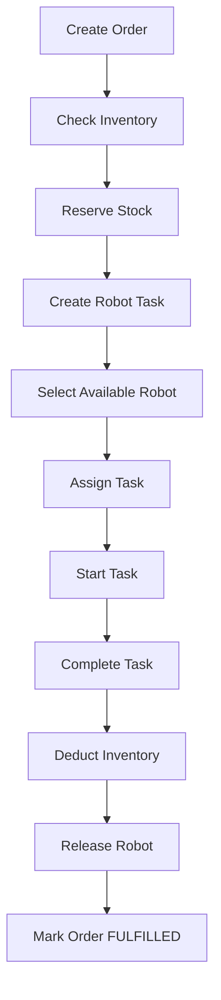
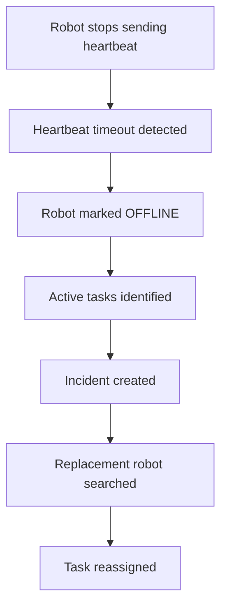
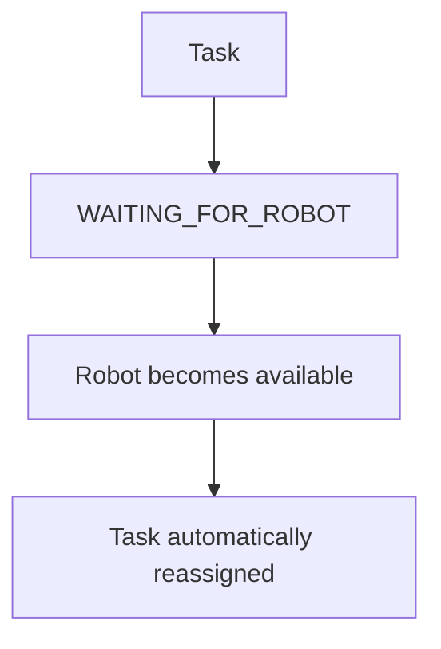

# Warehouse Fulfillment & Robot Orchestration System

A backend microservices system for warehouse order fulfillment, inventory management,
robot task assignment, heartbeat monitoring, failure detection, and automatic task recovery.

## Architecture

```text
                         ┌─────────────────┐
                         │   API Gateway   │
                         │     :8084       │
                         └────────┬────────┘
                                  │
              ┌───────────────────┼───────────────────┐
              │                   │                   │
              ▼                   ▼                   ▼
       ┌─────────────┐     ┌─────────────┐     ┌─────────────┐
       │    Order    │     │  Inventory  │     │    Robot    │
       │   Service   │     │   Service   │     │   Service   │
       │    :8080    │     │    :8081    │     │    :8082    │
       └──────┬──────┘     └─────────────┘     └──────┬──────┘
              │                                        │
              │                                        │
              └────────────────┐       ┌───────────────┘
                               ▼       ▼
                         ┌──────────────────┐
                         │   Orchestrator   │
                         │      :8083       │
                         └──────────────────┘

                         ┌──────────────────┐
                         │      Eureka      │
                         │      :8761       │
                         └──────────────────┘

                         ┌──────────────────┐
                         │   PostgreSQL     │
                         └──────────────────┘
```
# Services

| Service              | Port | Responsibility                                  |
| -------------------- | ---: | ----------------------------------------------- |
| Eureka Server        | 8761 | Service discovery                               |
| Order Service        | 8080 | Order creation and status management            |
| Inventory Service    | 8081 | Stock checking, reservation and completion      |
| Robot Service        | 8082 | Robot management, tasks, heartbeat and recovery |
| Orchestrator Service | 8083 | Fulfillment workflow coordination               |
| API Gateway          | 8084 | Single entry point and request routing          |

# Technology Stack
- Java 25
- Spring Boot
- Spring Cloud
- Spring Cloud Eureka
- Spring Cloud OpenFeign
- Spring Cloud Gateway
- PostgreSQL
- Maven
- REST APIs
- Docker / Docker Compose

# Core workflow



# Robot Selection
A robot is eligible when:
- Status is AVAILABLE
- Battery level is at least 30%

Among eligible robots, the robot with the highest battery level is selected.

# Robot Failure Recovery
The Robot Service monitors robot heartbeats.
## Robot Failure & Task Reassignment



If no replacement robot is available:
## Task Reassignment Workflow



# Incident Management
Robot failures create incidents containing:
- Robot
- Task
- Incident type
- Status
- Description
- Creation time
- Resolution time
 
Open incidents are prevented from being duplicated for the same task.

# Service communication
Services communicate using REST APIs and Spring Cloud OpenFeign.

Eureka provides service discovery so services can communicate using logical service names rather than hardcoded host addresses.

# Configuration
Database credentials are supplied through environment variables.